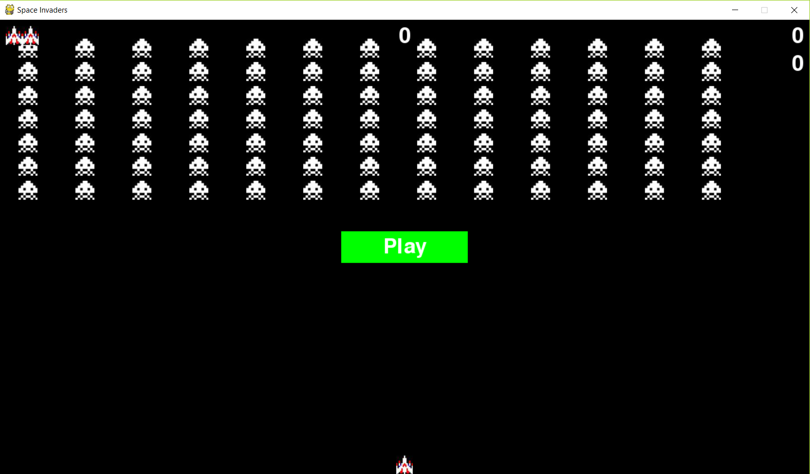

# Space Invaders

## Introduction

Learning project w/ tutorial from 'Python Crash Course'

Destroy as many waves of alien invaders as you can. 

The more waves you destroy, the faster they'll come at you.

##### Classic Space Invader Game

Built in Visual Studio 2017 w/ tutorial

Requires Python 3 and Pygame

Standalone project: Cloned the repo and run in Visual Studios. If using another IDE, use the core Python files with the assets folder only.

## Output

